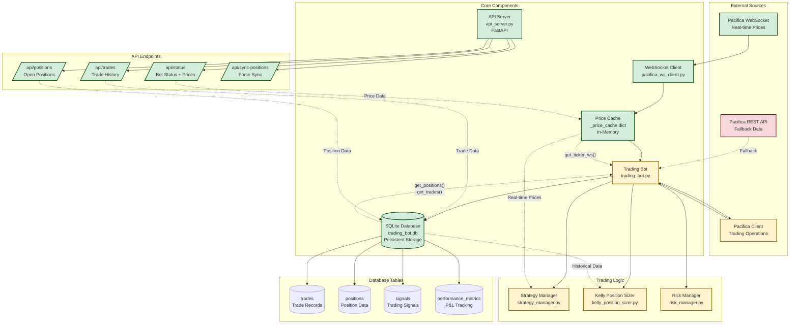
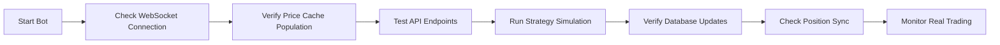

# Trading Bot Workflow Diagram



## Current State Analysis

### ✅ Working Components
- **WebSocket Client**: Successfully connects and parses price updates
- **Price Cache**: Stores real-time prices in memory for fast access
- **Database**: SQLite setup with all required tables (trades, positions, signals, metrics)
- **API Server**: FastAPI endpoints serving status, trades, positions
- **Database Tables**: All 15 tables created and functional

### ⚠️ Partially Working
- **Trading Bot**: Core logic exists but needs integration testing
- **Pacifica Client**: Trading operations interface (needs verification)
- **Strategy Manager**: Signal generation logic (needs testing)
- **Kelly Position Sizer**: Risk-adjusted sizing (depends on trade history)
- **Risk Manager**: Circuit breaker and position limits (needs validation)

### ❌ Needs Fixes
- **REST API Fallback**: Should be backup only, not primary data source
- **WebSocket Price Integration**: Ensure `get_ticker_ws` prioritizes cache over REST
- **Strategy Execution**: Verify signals trigger actual trades
- **Position Sync**: Ensure database positions match Pacifica state

## Critical Integration Points

### 1. Price Data Flow
```
WebSocket → Price Cache → Trading Bot → Strategies
```
**Status**: WebSocket parsing fixed, cache working, needs verification that strategies use cache.

### 2. Trade Execution Flow
```
Strategy Signal → Position Sizing → Risk Check → Client Order → Database Save
```
**Status**: Components exist but end-to-end flow needs testing.

### 3. Data Persistence Flow
```
Live Positions → Database → API Endpoints → Monitoring
```
**Status**: Database saves working, API serving data, needs sync verification.

## Required Fixes for Full Integration

1. **Verify Price Priority**: Ensure `get_ticker_ws` returns WebSocket cache data, not REST fallback
2. **Test Strategy Execution**: Run strategies with real signals and verify trade placement
3. **Position Synchronization**: Confirm database positions match Pacifica account state
4. **Error Handling**: Add graceful degradation when WebSocket disconnects
5. **Performance Monitoring**: Add metrics for cache hit rates and response times

## Testing Workflow



## Next Steps Priority

1. **High Priority**: Verify WebSocket price integration in trading decisions
2. **High Priority**: Test end-to-end trade execution flow
3. **Medium Priority**: Add comprehensive error handling and logging
4. **Medium Priority**: Implement automated position synchronization
5. **Low Priority**: Add performance monitoring and alerting</content>
<parameter name="filePath">trading_bot_workflow_diagram.md